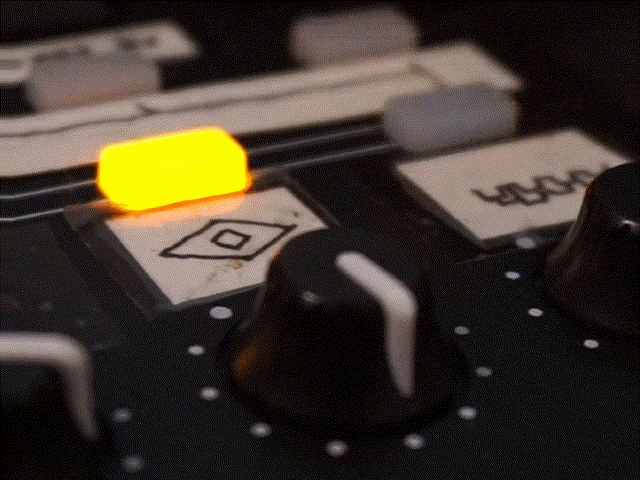

Cooldown
========

Cooldown is a tool developed to help feeding some rhythm into live-coding tools such as [Veda](https://veda.gl/) or [Kodelife](https://hexler.net/products/kodelife). Beats can be tapped on a MIDI controller and read in GLSL as texture data.

Building
--------

Cooldown is a regular Rust project. You can just run `cargo build` to build the project.

Usage
-----

You must provide as argument the address to which Cooldown will send the OSC messages, e.g. `cooldown 127.0.0.1:3615`. To receive this in Veda, add to the veda config this entry: `{ "osc": 3615 }`. To send OSC messages to KodeLife, I made a simple companion tool: [OscToSpout](https://github.com/eliemichel/OscToSpout).

Emitted OSC messages are:

    /time [current time in seconds]
    /beat1 [beat time] [frequency] [phase] [velocity]
    /beat2 ...
    ...

Limitations
-----------

Most limitations are due to the fact that this is a project developed mainly for myself, that I share for the sake of openness but that remains a personal tool.

 - The indexes of the MIDI input buttons are hard-coded to fit my own MIDI controller.
 - The code is not well organized and almost not commented.

License
-------

The MIT License

Copyright (c) 2019 -- Élie Michel <elie.michel@exppad.com>

Permission is hereby granted, free of charge, to any person obtaining a copy
of this software and associated documentation files (the "Software"), to deal
in the Software without restriction, including without limitation the rights
to use, copy, modify, merge, publish, distribute, sublicense, and/or sell
copies of the Software, and to permit persons to whom the Software is
furnished to do so, subject to the following conditions:

The above copyright notice and this permission notice shall be included in
all copies or substantial portions of the Software.

THE SOFTWARE IS PROVIDED "AS IS", WITHOUT WARRANTY OF ANY KIND, EXPRESS OR
IMPLIED, INCLUDING BUT NOT LIMITED TO THE WARRANTIES OF MERCHANTABILITY,
FITNESS FOR A PARTICULAR PURPOSE AND NONINFRINGEMENT. IN NO EVENT SHALL THE
AUTHORS OR COPYRIGHT HOLDERS BE LIABLE FOR ANY CLAIM, DAMAGES OR OTHER
LIABILITY, WHETHER IN AN ACTION OF CONTRACT, TORT OR OTHERWISE, ARISING FROM,
OUT OF OR IN CONNECTION WITH THE SOFTWARE OR THE USE OR OTHER DEALINGS IN
THE SOFTWARE.

